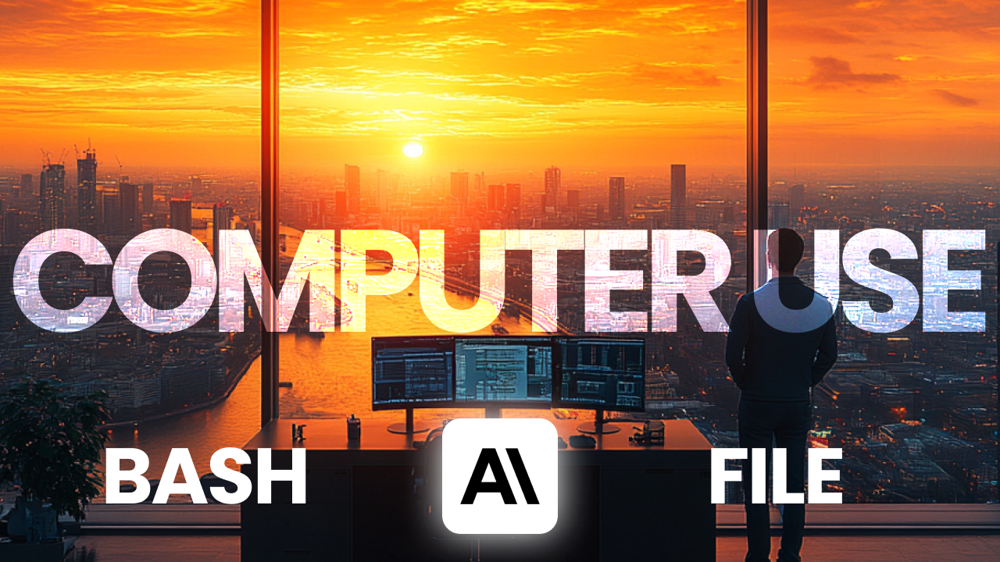
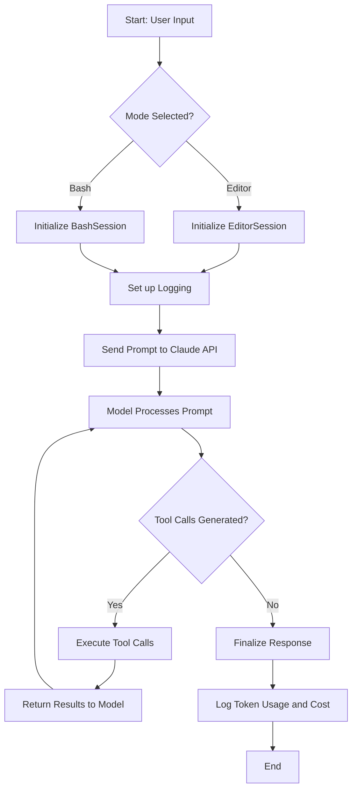

# Anthropic Computer Use POC -> Bash and Text Tools
> Let Claude 3.5 Sonnet NEW operate your terminal and edit your files for you.
> Proof of concept

## 📌 Interesting notes
> **Big takeaway: The AI Agents are coming** and for you and I, the engineer, **they're already here**.

- What does a prompt + code + related tools get you: AI Agents.
  - `It's clear this is the setup for AI Agents.`
  - Anthropic has created the first set of problem specific tools (tool belt) that are good (great) enough to be useful NEARLY out of the box.
  - We'll see if OpenAI and Google follow suit with this pattern.
- Anthropics text and bash tools are low key, very powerful. Engineers will miss this at first.
- The text editor tool supports five commands (tools): `view, create, str_replace, insert, and undo_edit`.
- The bash just has one tool `command`.
- Upon consuming your prompt, it will generate and execute a series of these tools based on your prompt that you're code will run.
- The real innovation here to me is two fold.
  - First, this runs a SERIES ((`prompt chaining strikes again`)) of these tools based on your prompt.
  - Second, the tools execute very well, are context aware and follow instructions very well. This is likely due to claude 3.5 sonnet new.

## ⚙️ Setup
- `brew install uv` or [install another way](https://docs.astral.sh/uv/getting-started/installation/#pypi).
- `uv sync`
- `cp .env.sample .env` and set your ANTHROPIC_API_KEY
- (text mode) `uv run main "hi please create a file called 'ping.txt' and write 'pong' in it."`
- (bash mode) `uv run main "show me the contents of the current directory" --mode bash`

## 🚀 Usage

### Editor Tool Usage
- Create and edit files with natural language:
  - `uv run main "hi please create a file called 'ping.txt' and write 'pong' in it."`
  - `uv run main "update the config.json file to add a new logging section" --mode editor`
  - `uv run main "create a new Python script that implements a basic web server" --mode editor`

### Bash Tool Usage  
- Execute shell commands through Claude:
  - `uv run main "show me the contents of the current directory" --mode bash`
  - `uv run main "show me the contents of the current directory" --mode bash--no-agi` (safe mode)
  - `uv run main "list tables from the data/app.db file" --mode bash`
  - `uv run main "read the first 3 lines of README.md and write insert them into the data/app.db sqlite database logging table" --mode bash` 

## 🌟 Very cool command sequence
- `uv run main "write a detailed 3 use case document for llms to a 'llm_use_cases.md' markdown file. then break that file into three going into details about the use cases."`
  - This will create a file at `./repo/llm_use_cases.md` with the 3 use cases.
  - Then it will break that file into three going into details about the use cases.
- `uv run main "update the llm_use_cases.md file to add a fourth use case for data analysis and insights."`
- `uv run main "read the llm_use_cases.md file and update it to contain a mermaid diagram of the use cases."`
- `uv run main "update llm_use_cases.md: simplify the mermaid chart and make it lr."`

## 🔄 Application Workflow

- The user provides a prompt to the application along with an optional mode (`editor` or `bash`).
- The application generates a session ID and initializes a `SessionLogger`.
- Depending on the chosen mode, either an `EditorSession` or `BashSession` is instantiated.
- The session sets up logging and assigns the `SessionLogger`.
- The application sends the user's prompt to the Claude model via the Anthropics API, including the appropriate system prompts and tool configurations.
- The model processes the prompt and may generate tool calls (e.g., text editing commands or bash commands).
- The application handles any tool calls by executing them and providing results back to the model if needed.
- The application may iterate through multiple interactions based on the model's responses.
- Upon completion, the application logs the total token usage and calculates the associated cost.

## 📚 Resources                                                                                                                   
                                                                                                                              
- https://docs.anthropic.com/en/docs/build-with-claude/computer-use                                                            
- https://github.com/anthropics/anthropic-quickstarts/blob/main/computer-use-demo/computer_use_demo/loop.py   
